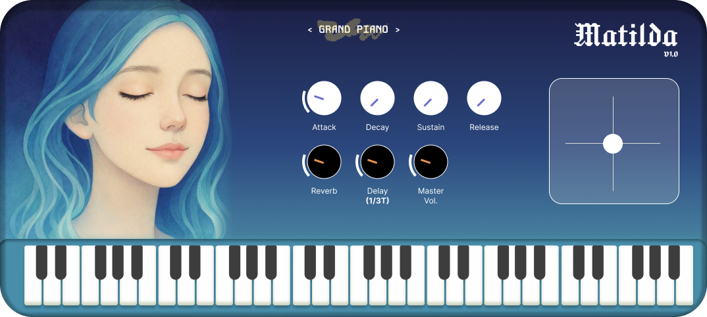
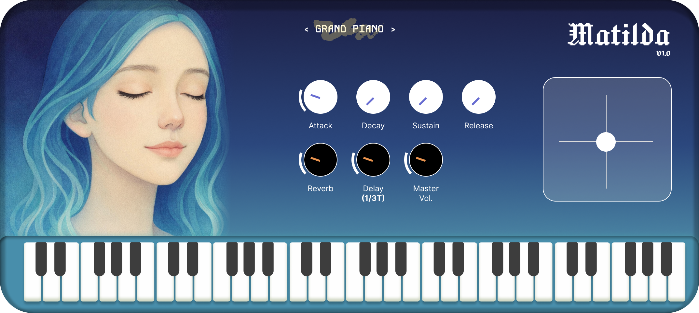
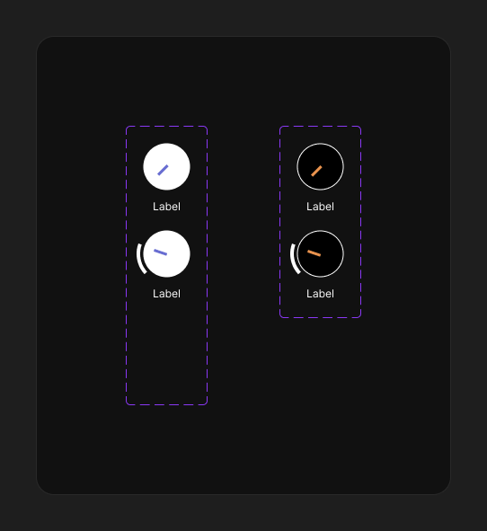
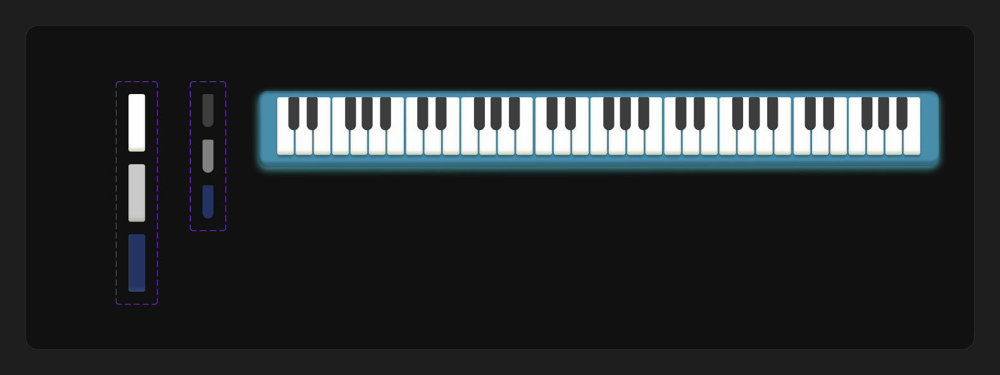
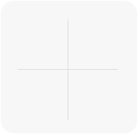

# Matilda Piano — Case Study Visual Journey

Screenshots and design captures for each critical milestone in the product journey. Use these in portfolios, presentations, or alongside `CASE-STUDY.md`.

---

## Journey map

| # | Milestone | File | Source |
|---|-----------|------|--------|
| 0 | **Hero / shipped v1 UI** | [00-readme-hero.png](00-readme-hero.png) | GitHub README capture |
| 1 | **Figma design source (full frame)** | [01-figma-design-source.png](01-figma-design-source.png) | Figma — frame `4203:94317` |
| 2 | **Brand panel artwork** | [02-left-panel-artwork.png](02-left-panel-artwork.png) | Exported asset |
| 3 | **v1 — sample engine UI (built app)** | [03-v1-sample-ui-built.png](03-v1-sample-ui-built.png) | Run capture script* |
| 4 | **v2 — physical model UI (built app)** | [04-v2-physical-ui-built.png](04-v2-physical-ui-built.png) | Run capture script* |
| 5 | **v3 — minimal knob system (Figma)** | [05-v3-minimal-knobs-figma.png](05-v3-minimal-knobs-figma.png) | Figma — node `4584:95219` |
| 6 | **Custom keyboard states (Figma)** | [06-custom-keyboard-figma.png](06-custom-keyboard-figma.png) | Figma — node `4586:95255` |
| 7 | **XY pad component** | [07-xy-pad-asset.png](07-xy-pad-asset.png) | Exported asset |
| 8 | **Keyboard reference asset** | [08-keyboard-asset-reference.png](08-keyboard-asset-reference.png) | Exported asset |
| 9 | **v3 — neural engine UI (built app)** | [09-v3-neural-ui-built.png](09-v3-neural-ui-built.png) | Run capture script* |

\* Built-app captures require a local build and screen-recording permission. From the project root:

```bash
chmod +x scripts/capture-case-study-screenshots.sh
./scripts/capture-case-study-screenshots.sh
```

If capture fails, grant **Screen Recording** to Terminal (or Cursor) in **System Settings → Privacy & Security → Screen Recording**, then retry.

---

## Critical junctures (design narrative)

### 1. Design intent (Figma)


Original 1074×483 frame: portrait, chicken-head knobs, ADSR + effects, XY pad, keyboard. This is where layout and visual hierarchy were locked.

### 2. v1 — UI ships with samples


First working product: full custom interface, sample-based piano. Proved the interaction model even though timbre underwhelmed testers.

### 3. v2 — Same UI, new engine
Same layout as v1 (capture `04-v2-physical-ui-built.png` after running the script). Users saw no change on screen; sound became more dynamic but still not “grand piano.”

### 4. v3 — Visual refresh + neural sound


Minimal circular knobs with purple (ADSR) and gold (effects) indicators. Capture `09-v3-neural-ui-built.png` for the full built v3 window.

### 5. Custom keyboard


Idle, hover, and pressed states for white and black keys; teal bedding strip. Replaces stock JUCE keyboard styling.

### 6. XY pad — expressive control


Two-axis tape/flutter control because a piano doesn’t bend like a synth.

### 7. User feedback fixes (no screenshot — behavioral)
- Delay: milliseconds → tempo-synced subdivisions  
- Volume: matched perceived loudness to other plugins  
- Middle C: fixed octave transposition without relabeling keys  

---

## Figma links

- Full frame: [AdMaker-CMS — 4203:94317](https://www.figma.com/design/jdsiHSEmMSTHUkDlgKSiod/AdMaker-CMS?node-id=4203-94317)
- v3 knobs: [4584:95219](https://www.figma.com/design/jdsiHSEmMSTHUkDlgKSiod/AdMaker-CMS?node-id=4584-95219)
- Keyboard: [4586:95255](https://www.figma.com/design/jdsiHSEmMSTHUkDlgKSiod/AdMaker-CMS?node-id=4586-95255)

---

## Optional: GarageBand / DAW shots

For host-integration slides, capture manually:

1. GarageBand → Software Instrument → **Matilda Piano 3** (AU list)  
2. Logic Pro → plugin window with automation visible  
3. Finder → `~/Library/Audio/Plug-Ins/VST3/Matilda Piano 3.vst3`

Save as `10-garageband-au.png`, `11-logic-host.png`, etc. in this folder.
